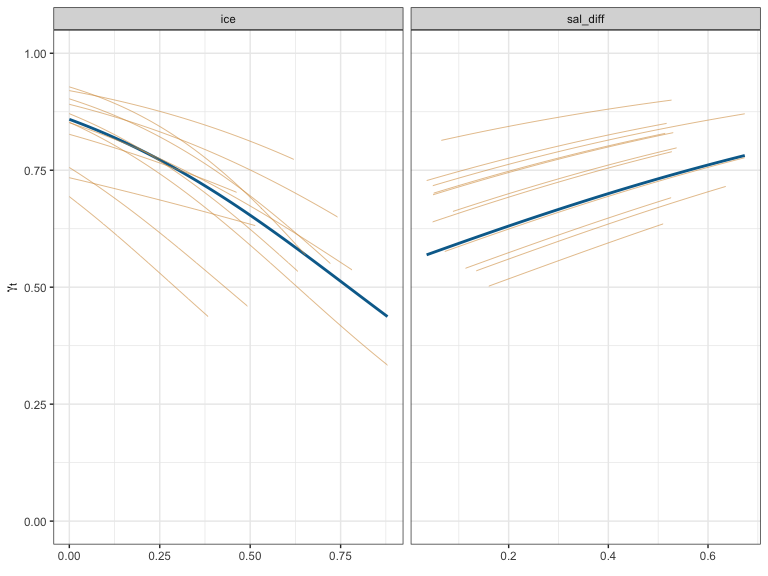

<!-- README.md is generated from README.Rmd. Please edit that file -->

**mpmm** - fit movement persistence mixed-effects models to animal
tracking data

<!-- badges: start -->

[](https://lifecycle.r-lib.org/articles/stages.html#experimental)

master branch:  
[](https://github.com/ianjonsen/mpmm/actions/workflows/R-CMD-check.yaml)

dev branch:  
[](https://github.com/ianjonsen/mpmm/actions/workflows/R-CMD-check.yaml)
<!-- badges: end -->

`mpmm` is an R package that fits movement persistence mixed-effect
models to animal tracking data for inference of linear relationships
with covariates, accounting for individual variability (Jonsen et
al. 2019. Ecology 100:e02566). Random effects are assumed to be
approximately normal. It is assumed that the location data are either
relatively error-free (e.g., GPS locations) or filtered estimates from a
state-space model fitted to error-prone data (e.g., Argos locations).
Models are specified using standard mixed-model formulas, as you would
in `lme4` or `glmmTMB`. The movement persistence model can be fit as
either a discrete-time (Jonsen et al. 2019) or a continuous-time
(Auger-Méthé et al. 2017. MEPS 565:237-249) process. The underlying code
for specifying and estimating fixed and random effects borrows heavily
on `glmmTMB` code, but is implemented in a more limited manner in
`mpmm`. Currently, only diagonal or unstructured covariances are
possible; interaction terms are not possible; the grouping term for the
random effects is always assumed to be the individual animal `id` (or
individual sub-tracks `tid`).

## Installation

First, ensure you have R version &gt;= 3.6.0 installed (preferably R
4.0.0 or higher):

``` r
R.Version()
```

### From GitHub (source)

On PC’s running Windows, ensure you have installed
[Rtools](https://cran.r-project.org/bin/windows/Rtools/)

On Mac’s, ensure you have installed the [Command Line Tools for
Xcode](https://developer.apple.com/download/more/) by executing
`xcode-select --install` in the terminal; or you can download the latest
version from the URL (free developer registration may be required). A
full Xcode install uses up a lot of disk space and is not required.

Currently, `mpmm` can only be installed from GitHub:

``` r
remotes::install_github("ianjonsen/mpmm")
```

Note: there can be issues getting compilers to work properly, especially
on a Mac with OS X 10.13.x or higher. If you encounter install and
compile issues, I recommend you consult the excellent information on the
[glmmTMB](https://github.com/glmmTMB/glmmTMB) GitHub.

## Basic example

`mpmm` fits mixed models and facilitates model selection, validation and
visualisation of estimated covariate relationships:

``` r
library(mpmm)

fit <-
  mpmm(
    ~ ice + sal_diff + (ice |
               id),
    data = ellie.ice,
    control = mpmm_control(
      REML = TRUE, 
      verbose = 0 # turn off parameter trace for tidy output
    )
  ) 
#> using nlminb BFGS with REML=TRUE 
#> 
#> convergence:  yes

summary(fit)
#> Formula: ~ ice + sal_diff + (ice | id) 
#> Data:  ellie.ice 
#> 
#>        AIC      BIC   logLik  deviance df.resid
#>  -9532.122 -9487.39 4773.061 -9546.122     4397
#> 
#> 
#> Random effects: ~ (ice | id) 
#>  Group        Name Variance StdDev  Corr
#>     id (Intercept)    0.560  0.748      
#>                ice    0.903  0.950 -0.36
#>           Residual    0.262 -0.512      
#> number of obs: 4404, group: id
#> 
#> fixed effects: ~ ice + sal_diff 
#>            Value Std.Error z value Pr(>|z|)    
#> Intercept  1.252     0.275    4.55  5.4e-06 ***
#> ice       -2.340     0.396   -5.91  3.4e-09 ***
#> sal_diff   1.560     0.446    3.50  0.00046 ***
#> ---
#> Signif. codes:  0 '***' 0.001 '**' 0.01 '*' 0.05 '.' 0.1 ' ' 1

plot(fit)
```

<!-- -->
